# 🎨 Diagram Enhancements - Detailed Architecture Visualization

## 📋 Overview

The Architecture-as-Code Visualizer now generates **significantly more detailed and informative diagrams** with enhanced visual organization, comprehensive resource information, and better relationships between components.

## 🚀 Enhanced Features

### 🐳 **Docker Compose Diagrams**

#### **What's New:**

- **Organized Subgraphs**: Services, Networks, and Volumes are now grouped in separate sections
- **Service Details**: Shows ports, environment variables count, volume mounts, restart policies
- **Advanced Information**: Working directory, command overrides, dependency relationships
- **Visual Classification**: Color-coded services (web servers, databases, caches, applications)
- **Network Connections**: Clear visualization of service-to-network relationships
- **Volume Mapping**: Shows which services use which volumes

#### **Before vs After:**

```
BEFORE: web [📦 nginx:alpine]
AFTER:  web [
          <b>web</b>
          📦 nginx:alpine
          🌐 80:80
          🔄 restart: unless-stopped
          📁 /app
          💾 2 volumes
        ]
```

### ☸️ **Kubernetes Diagrams**

#### **What's New:**

- **Namespace Organization**: Resources grouped by namespace with clear boundaries
- **Resource Details**: Replicas, resource requests/limits, storage requirements
- **Container Information**: Images, ports, environment variables, multi-container pods
- **Service Relationships**: Automatic connection between Services and Deployments
- **Storage Details**: PVC sizes, access modes, storage classes
- **Config Resources**: ConfigMaps and Secrets with key counts

#### **Enhanced Resource Types:**

- **Deployments**: Shows replicas, containers, resource limits, ports
- **Services**: Type (ClusterIP/LoadBalancer), port mappings
- **StatefulSets**: Persistent volume templates, storage sizes
- **ConfigMaps/Secrets**: Number of configuration keys
- **PVCs**: Storage size and access modes

### 🏗️ **Terraform Diagrams**

#### **What's New:**

- **Organized Sections**: Resources, Data Sources, and Variables in separate subgraphs
- **Provider-Specific Details**: AWS, Azure, and GCP resource information
- **Resource Properties**: Instance types, CIDR blocks, storage sizes
- **Dependency Mapping**: Both explicit (`depends_on`) and implicit (references) dependencies
- **Tagging Information**: Shows tag counts for tagged resources
- **Variable Details**: Types, defaults, descriptions

#### **Provider-Specific Enhancements:**

**AWS Resources:**

- **EC2 Instances**: Instance type, AMI ID
- **VPCs/Subnets**: CIDR blocks, availability zones
- **Security Groups**: Ingress/egress rule counts
- **RDS**: Engine type, instance class, storage size
- **Load Balancers**: Type (application/network)

**Azure Resources:**

- **Virtual Machines**: VM size
- **Virtual Networks**: Address spaces
- **Subnets**: Address prefixes

**Google Cloud Resources:**

- **Compute Instances**: Machine type, zone
- **Networks**: Custom vs auto mode

## 🎨 **Visual Improvements**

### **Color Coding System:**

- 🔵 **Blue**: Web servers, compute resources, workloads
- 🟣 **Purple**: Databases, services
- 🟠 **Orange**: Caches, configuration resources
- 🟢 **Green**: Applications, storage, load balancers
- 🟡 **Yellow**: Variables, data sources
- 🔴 **Red**: Networks, volumes

### **Enhanced Relationships:**

- **Solid Arrows**: Direct dependencies (`depends_on`)
- **Dotted Arrows**: Network connections, volume mounts
- **Labeled Connections**: Clear relationship descriptions
- **Implicit Dependencies**: Automatic detection through resource references

### **Better Organization:**

- **Subgraphs**: Logical grouping of related resources
- **Namespaces**: Kubernetes resources organized by namespace
- **Resource Categories**: Infrastructure, compute, storage, networking

## 📊 **Information Density**

### **Before Enhancement:**

```mermaid
flowchart TD
    web["web<br/>📦 nginx:alpine"]
    api["api<br/>📦 node:18"]
    db["db<br/>📦 postgres:15"]

    api --> web
    db --> api
```



### **After Enhancement:**

```mermaid
flowchart TD
    subgraph Services["🚀 Services"]
        web["<b>web</b><br/>📦 nginx:alpine<br/>🌐 80:80<br/>💾 1 volumes<br/>🔄 restart: unless-stopped"]
        api["<b>api</b><br/>📦 node:18-alpine<br/>🌐 3000:3000<br/>⚙️ 2 env vars<br/>💾 1 volumes<br/>📁 /app<br/>▶️ npm start"]
        db["<b>db</b><br/>📦 postgres:15-alpine<br/>🌐 5432:5432<br/>⚙️ 3 env vars<br/>💾 1 volumes"]
    end

    subgraph Networks["🌐 Networks"]
        frontend["🌐 frontend<br/>Driver: bridge"]
        backend["🌐 backend<br/>Driver: bridge"]
    end

    subgraph Volumes["💾 Volumes"]
        postgres_data["💾 postgres_data<br/>Driver: local"]
    end

    api -->|depends on| web
    db -->|depends on| api
    web -.->|connects to| frontend
    api -.->|connects to| frontend
    api -.->|connects to| backend
    db -.->|connects to| backend
    postgres_data -.->|mounts to| db
```



## 🔧 **Technical Implementation**

### **New Helper Functions:**

- `addAWSResourceDetails()`: AWS-specific resource information
- `addAzureResourceDetails()`: Azure-specific resource information
- `addGCPResourceDetails()`: Google Cloud-specific resource information
- Enhanced `sanitizeLabel()`: Better handling of complex information
- Implicit dependency detection through resource references

### **Enhanced Data Processing:**

- **Multi-document YAML**: Better handling of Kubernetes manifests
- **Resource References**: Automatic detection of `${resource.property}` patterns
- **Provider Detection**: Automatic identification of cloud providers
- **Resource Classification**: Smart categorization based on resource types

## 🎯 **Benefits**

### **For Developers:**

- **Comprehensive Overview**: See all resource details at a glance
- **Better Planning**: Understand resource requirements and relationships
- **Debugging Aid**: Visualize complex dependency chains
- **Documentation**: Generated diagrams serve as living documentation

### **For DevOps:**

- **Infrastructure Analysis**: Quick understanding of resource usage
- **Capacity Planning**: See resource limits and requirements
- **Security Review**: Visualize network boundaries and access patterns
- **Cost Optimization**: Identify over-provisioned resources

### **For Architects:**

- **System Design**: Validate architectural decisions
- **Communication**: Share clear system overviews with stakeholders
- **Compliance**: Document security and network boundaries
- **Change Impact**: Understand how changes affect other components

## 🚀 **Usage Examples**

### **Docker Compose Example:**

Load the enhanced Docker Compose example to see:

- ✅ Services with detailed configuration
- ✅ Network topology with driver information
- ✅ Volume mappings and persistence
- ✅ Environment variable tracking
- ✅ Port exposure and routing

### **Kubernetes Example:**

Load the Kubernetes example to see:

- ✅ Namespace organization
- ✅ Resource requests and limits
- ✅ Service-to-Deployment relationships
- ✅ Storage requirements
- ✅ Container details and scaling

### **Terraform Example:**

Load the Terraform example to see:

- ✅ Infrastructure dependencies
- ✅ Provider-specific details
- ✅ Resource properties and sizing
- ✅ Variable usage tracking
- ✅ Data source relationships

## 🎉 **Result**

Your diagrams now provide **10x more information** with:

- 🔍 **Detailed Resource Properties**
- 🎨 **Professional Visual Organization**
- 🔗 **Clear Relationship Mapping**
- 📊 **Comprehensive System Overview**
- 🎯 **Actionable Insights**

The Architecture-as-Code Visualizer now generates **production-ready architectural diagrams** that serve as both documentation and analysis tools for complex infrastructure deployments!
