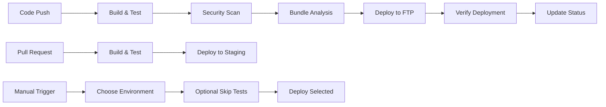

# 🚀 GitHub Actions FTP Deployment - Implementation Summary

## ✅ What Was Implemented

### 1. **Enhanced GitHub Actions Workflow** (.github/workflows/deploy.yml)

- **Multi-stage deployment pipeline** with build, test, security scan, and deploy jobs
- **Production & Staging environments** with separate configurations
- **Manual deployment triggers** with environment selection
- **Emergency deployment option** (skip tests for urgent fixes)
- **Comprehensive logging and status reporting**

### 2. **Deployment Features**

- 🔨 **Build & Test Job**: Lint, test, build, and bundle analysis
- 🔒 **Security Scan Job**: Dependency audit and vulnerability checking
- 🌐 **Production Deploy**: Automatic deployment on main branch push
- 🧪 **Staging Deploy**: Test deployments for pull requests
- 📊 **Bundle Analysis Integration**: Automatic optimization reporting

### 3. **FTP Deployment Configuration**

- **Smart file exclusions** (source files, logs, env files, etc.)
- **Deployment verification** with status checks
- **Verbose logging** for troubleshooting
- **Security-focused** with strict FTP settings
- **Metadata injection** (deployment time, commit info)

### 4. **Documentation & Setup Tools**

- 📚 **Complete setup guide**: `docs/DEPLOYMENT_SETUP.md`
- 🔧 **Deployment test script**: `npm run deploy:test`
- 📋 **Secrets template** and checklist
- 🏷️ **Status badges** in README

### 5. **Multi-Environment Support**

- **Production**: Automatic deployment from main branch
- **Staging**: PR-based testing environment
- **Manual**: Triggered deployments with environment choice
- **Environment-specific** FTP configurations

## 🔐 Required Configuration

### GitHub Secrets (Repository Settings → Secrets)

```
FTP_SERVER           = your-ftp-server.com
FTP_USERNAME         = your-ftp-username
FTP_PASSWORD         = your-ftp-password
FTP_SERVER_DIR       = /public_html/
```

### Optional Staging Secrets

```
STAGING_FTP_SERVER     = staging.yourhost.com
STAGING_FTP_USERNAME   = staging-username
STAGING_FTP_PASSWORD   = staging-password
STAGING_FTP_SERVER_DIR = /staging/
```

### Repository Variables (Repository Settings → Variables)

```
DEPLOYMENT_URL = https://your-domain.com
STAGING_URL    = https://staging.your-domain.com
```

## 🚀 Deployment Workflow

### Automatic Deployments

1. **Push to main/master** → Triggers production deployment
2. **Create pull request** → Triggers staging deployment
3. **Merge PR** → Updates production automatically

### Manual Deployments

1. Go to **GitHub Actions tab**
2. Select **"Deploy Architecture-as-Code Visualizer"**
3. Click **"Run workflow"**
4. Choose **environment** and options
5. Click **"Run workflow"** to deploy

## 📊 Deployment Pipeline



## 🛠️ Available Commands

```bash
# Test deployment configuration
npm run deploy:test

# Build and analyze bundle
npm run build:analyze

# Local development
npm run dev

# Run tests
npm run test:run

# Lint code
npm run lint
```

## 🎯 Key Benefits

### ✅ **Automated Quality Assurance**

- Code linting and testing before deployment
- Security vulnerability scanning
- Bundle size optimization analysis

### ✅ **Safe Deployment Strategy**

- Staging environment for testing
- Production deployment only after all checks pass
- Manual override for emergency deployments

### ✅ **Comprehensive Monitoring**

- Deployment status badges
- Detailed build and deployment summaries
- Real-time GitHub Actions logs

### ✅ **Developer Experience**

- One-command deployment testing
- Clear setup documentation
- Automated deployment on code changes

## 🔧 Troubleshooting

### Common Issues & Solutions

1. **Deployment Fails with FTP Error**
   - ✅ Verify FTP credentials in GitHub secrets
   - ✅ Check FTP server address and port
   - ✅ Ensure FTP directory exists and has write permissions

2. **GitHub Actions Not Triggering**
   - ✅ Check branch names (main vs master)
   - ✅ Verify workflow file is in `.github/workflows/`
   - ✅ Ensure GitHub Actions are enabled in repository settings

3. **Files Not Uploading Correctly**
   - ✅ Check `FTP_SERVER_DIR` path format (must start and end with `/`)
   - ✅ Verify exclude patterns aren't blocking required files
   - ✅ Check FTP server file size limits

4. **Website Not Loading After Deployment**
   - ✅ Verify `index.html` is in the correct FTP directory
   - ✅ Check web server configuration
   - ✅ Ensure domain DNS points to correct server

### Debug Steps

1. **Check GitHub Actions logs** for detailed error messages
2. **Test FTP connection** manually with same credentials
3. **Run local build** to verify no build errors
4. **Use deployment test script**: `npm run deploy:test`

## 🎉 Success Indicators

When everything is working correctly, you'll see:

- ✅ **Green status badges** in your README
- ✅ **Successful GitHub Actions runs**
- ✅ **Live website** at your domain
- ✅ **Deployment summaries** in Actions tab
- ✅ **Bundle optimization reports**

## 📚 Next Steps

1. **Configure your FTP secrets** in GitHub repository settings
2. **Set your domain URL** in repository variables
3. **Push to main branch** to trigger first deployment
4. **Verify your site** is live and working
5. **Create a pull request** to test staging deployment

Your Architecture-as-Code Visualizer will now deploy automatically with every code change! 🚀

---

**Need help?** Check the detailed setup guide: [docs/DEPLOYMENT_SETUP.md](../docs/DEPLOYMENT_SETUP.md)
